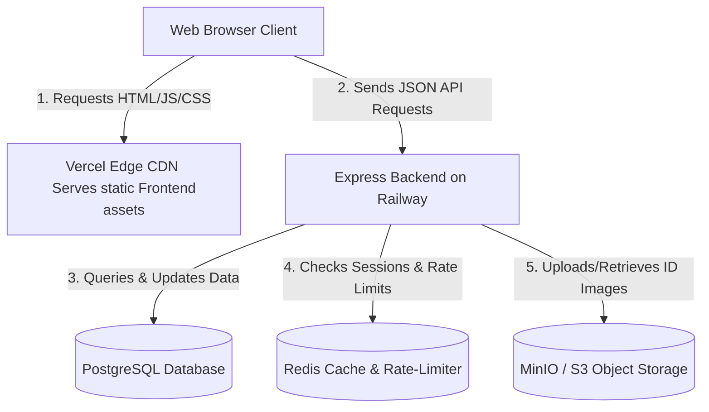

# Technical Stack Reference & Architecture Guide

This document provides a comprehensive breakdown of the technology stack used in the **SGSITS Visitor Entry-Exit System**. Use this guide to understand what each technology does, why it was chosen, and how it is implemented in this codebase.

---

## 🏗️ High-Level System Architecture

The project is structured as a decoupled, multi-tier system:



---

## 1. The Backend (Server Logic)

### Node.js & TypeScript
* **What it is**: **Node.js** is a runtime environment that allows us to run JavaScript on the server side (outside the browser). **TypeScript** is a typed superset of JavaScript that catches errors early during development by enforcing static type checking.
* **Role in this project**: Powering the entire backend business logic, validation, API routing, and security.
* **Code Example**:
  ```typescript
  // Enforcing strict type checking for requests
  export interface CreatePassDto {
    visitorId: string;
    passType: 'VISITOR' | 'HOSTEL_GUEST' | 'VEHICLE';
    validFrom: Date;
    validTo: Date;
  }
  ```

### Express.js
* **What it is**: A minimalist web framework for Node.js. It handles routing HTTP requests (GET, POST, etc.) and mounting middleware.
* **Role in this project**: Exposing the REST API endpoints that the React frontend calls.
* **Code Example**:
  ```typescript
  import express from 'express';
  const app = express();

  // Defining an endpoint
  app.get('/api/v1/health', (req, res) => {
    res.status(200).json({ success: true, message: "System is healthy" });
  });
  ```

### Socket.io
* **What it is**: A library that enables real-time, bi-directional, event-based communication between the web browser and the server.
* **Role in this project**: Broadcasting instant notifications (e.g., notifying guards when a pass is approved, alerting wardens of guest check-ins, or triggering campus-wide emergency lockouts).
* **Code Example**:
  ```typescript
  // Emitting a real-time event from the server
  io.to(`role:SECURITY_ADMIN`).emit('notification:new-alert', {
    title: 'Emergency Lockdown',
    body: 'Lockdown initiated at Main Gate.'
  });
  ```

---

## 2. The Database & Caching Layer

### PostgreSQL
* **What it is**: An enterprise-grade, open-source relational database (RDBMS) that stores data in structured tables with columns, keys, and indexes.
* **Role in this project**: Storing persistent data such as Users, Passes, Visitors, Logs, and Settings securely.
* **Role of Indexes**: Indexes are lookup directories created on database columns. For example, instead of searching the entire table of passes for a QR token (which is slow), PostgreSQL uses the `qrToken` index to find it instantly.

### Prisma ORM
* **What it is**: An Object-Relational Mapper (ORM). It allows developers to write database queries using clean JavaScript/TypeScript objects instead of writing raw SQL queries.
* **Role in this project**: Managing database tables, running migrations, and executing clean queries.
* **Code Example**:
  ```typescript
  // Fetching a pass including its visitor details using Prisma
  const pass = await prisma.pass.findUnique({
    where: { id: passId },
    include: { visitor: true } // Joins tables automatically
  });
  ```

### Redis
* **What it is**: An in-memory, key-value data structure store used as a database, cache, and message broker. Since it runs in RAM, it responds in microseconds.
* **Role in this project**: 
  1. Storing rate-limiting counts to block spam.
  2. Storing brute-force counters for failed logins.
  3. Storing temporary tokens.
* **Code Example**:
  ```typescript
  // Setting a security lockout key that automatically expires in 30 minutes
  await redis.set(`lockout:${email}`, 'true', 'EX', 30 * 60);
  ```

---

## 3. Object Storage (File Uploads)

### MinIO / AWS S3
* **What it is**: An object storage system designed to store unstructured files (like images, PDFs, videos) rather than rows of text. MinIO is an open-source S3-compatible server that can be run locally.
* **Role in this project**: Storing visitor ID proof uploads and profile photos.
* **Why not store files in PostgreSQL?**: Large files (like 5MB photos) degrade database query speeds and bloat backups. Storing files in MinIO and saving only the *file key* in PostgreSQL keeps the database fast and lightweight.
* **Code Example**:
  ```typescript
  // Uploading a file buffer to MinIO bucket
  await minioClient.putObject(
    'gatepass-assets', 
    'visitor-ids/uuid-card.jpg', 
    fileBuffer
  );
  ```

---

## 4. The Frontend (Client Application)

### React (Vite)
* **What it is**: A component-based JavaScript library for building user interfaces. **Vite** is a modern build tool that bundles files and hot-reloads the page instantly during development.
* **Role in this project**: Powering the responsive client portal dashboard and login screens.

### Redux Toolkit (RTK)
* **What it is**: A predictable state container for managing application-wide global state.
* **Role in this project**: Storing the logged-in user's profile and active session states so all components know if the user is authenticated without re-fetching.
* **Code Example**:
  ```typescript
  // Accessing the logged-in user from the Redux store
  const user = useSelector((state: RootState) => state.auth.user);
  ```

### Axios
* **What it is**: A promise-based HTTP client for making API requests to the backend.
* **Role in this project**: Sending requests to the backend server (e.g., sending login credentials, requesting a pass, scanning a token).
* **Interceptors**: We use interceptors to automatically attach the secure JWT `Authorization` header to every outgoing request, and to handle automated token refreshes if a session expires.
* **Code Example**:
  ```typescript
  // Axios request interceptor
  api.interceptors.request.use((config) => {
    const token = localStorage.getItem('accessToken');
    if (token) {
      config.headers.Authorization = `Bearer ${token}`;
    }
    return config;
  });
  ```

---

## 5. Deployment & Containerization

### Docker & Docker Compose
* **What it is**: **Docker** wraps software in filesystem "containers" containing everything it needs to run (code, runtime, tools, libraries), guaranteeing it behaves the same on any system. **Docker Compose** lets us run multi-container applications with a single command.
* **Role in this project**: Bundling the frontend, backend, PostgreSQL, Redis, and MinIO into isolated containers so the entire system starts up cleanly with one command (`docker-compose up`).

---

## 🧠 Diagnostic Summary (Q&A for Tech Reviews)

#### 1. How does verification work at the gates?
When a visitor shows a pass, the security guard scans the QR code containing a secure redirect URL (`/terminal?token=...`). The terminal parses the cryptographic token, calls the `/passes/verify` API, decrypts the token on the server using AES-256 and validates its integrity using HMAC-SHA256, then updates the entry log instantly in PostgreSQL.

#### 2. What happens if a visitor overstays?
A background cron job runs every 5 minutes in the backend. It queries active passes where `validTo` has passed and exit logs are missing. If found, it marks them as an overstay, alerts the security console via **Socket.io**, and sends an in-app warning.

#### 3. How secure is the user session?
The app uses a dual-token setup:
1. Short-lived **Access Token** (JWT, stored in memory/localStorage, valid for 15 minutes).
2. Long-lived **Refresh Token** (HttpOnly, Secure cookie, stored in the PostgreSQL database for validation, valid for 7 days).
If the access token expires, Axios interceptors seamlessly hit the `/auth/refresh` endpoint to request a new access token without interrupting the user.
